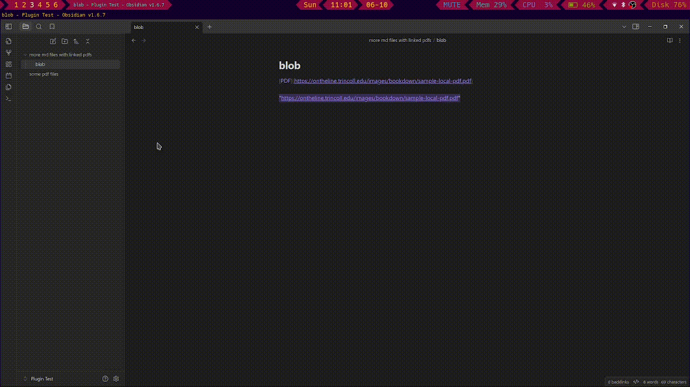

# downloadPDF
A small plugin that allows you to download all your PDF files and save them locally

# Use
Open your command palette and use `downloadPDF: download pdf files in all documents` to download all PDF files to the parent directory of each linked file.

